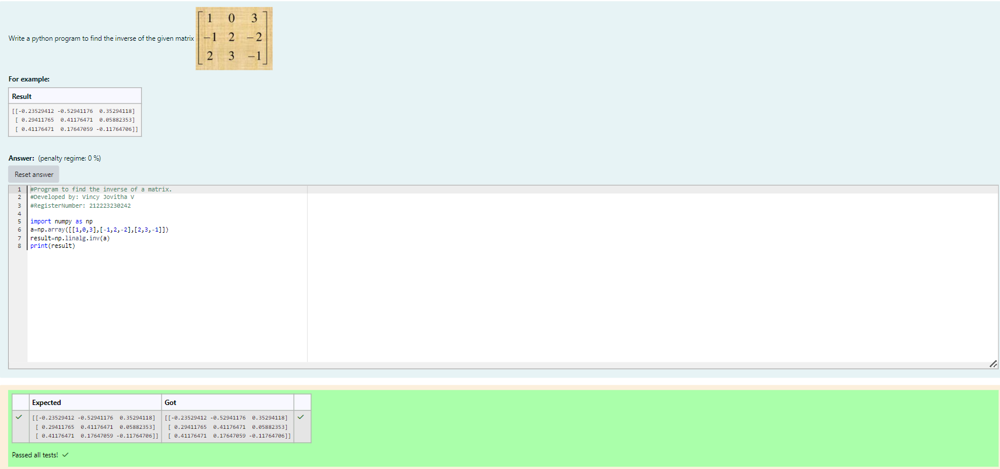

# INVERSE-OF-A-MATRIX
## Aim:
To write a python program to find the inverse of a matrix
## Equipment’s required:
1. 	Hardware – PCs
2. 	Anaconda – Python 3.7 Installation / Moodle-Code Runner
## Algorithm:
### Step1 : 
Import the numpy module to use the built-in functions for calculation

### Step 2: 
Prepare the list from the given matrix and assign in np.array().

### Step 3: 
Calculate the Inverse of the matrix using np.linalg.inv()

### Step 4: 
End the program.

## Program:
```
#Program to find the inverse of a matrix.
#Developed by: Vincy Jovitha V
#RegisterNumber: 212223230242

import numpy as np
a=np.array([[1,0,3],[-1,2,-2],[2,3,-1]])
result=np.linalg.inv(a)
print(result)
```

## Output:


## Result:
Thus the inverse of given matrix is successfully solved using python program

